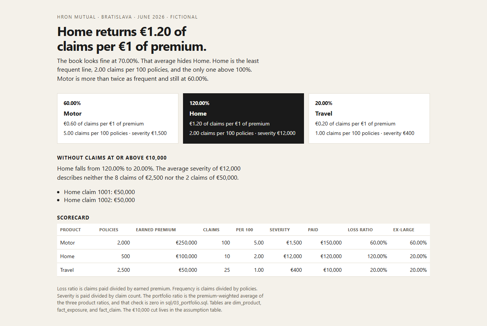

# Loss ratio

[](https://github.com/LiKeT128/loss-ratio/actions/workflows/build.yml) · **[Live scorecard →](https://liket128.github.io/loss-ratio/)**

A one-page portfolio scorecard for a fictional Bratislava insurer, Hron Mutual. June looks acceptable at a 70% loss ratio. One product does not.

Home returns €1.20 of claims for every €1 of earned premium. Motor returns €0.60. Travel returns €0.20.

Home is also the least frequent line: 2 claims per 100 policies, against 5 for Motor. The loss ratio is a severity problem. Two Home claims are €50,000 each. The other eight are €2,500. Take the two large claims out and Home falls to 20%.

| Product | Policies | Earned premium | Claims per 100 | Severity | Loss ratio | Without large claims |
| --- | ---: | ---: | ---: | ---: | ---: | ---: |
| Motor | 2,000 | €250,000 | 5.00 | €1,500 | 60% | 60% |
| Home | 500 | €100,000 | 2.00 | €12,000 | 120% | 20% |
| Travel | 2,500 | €50,000 | 1.00 | €400 | 20% | 20% |

The book is the premium-weighted average of those three ratios, which is 70%.



## Run

```powershell
python build_scorecard.py
```

Open `scorecard/index.html`. Python 3.11+ and the standard library. No packages.

## The model

Three tables, which is the shape a Power BI model would use:

- `dim_product` — Motor, Home, Travel
- `fact_exposure` — policies and earned premium, one row per product for June
- `fact_claim` — one row per claim, with the amount paid

Measures in `v_product_scorecard`:

- Frequency = claims / policies, stored in basis points
- Severity = paid / claim count
- Loss ratio = paid / earned premium, stored in basis points

`sql/01_scorecard.sql` checks each product: severity times the claim count equals paid, frequency times policies equals the claim count, and the loss ratio times premium equals paid. `sql/03_portfolio.sql` checks that the product rows add back to the claim table, and that the premium-weighted average equals the portfolio loss ratio. Both unexplained columns are zero.

A claim is large when paid amount is at least the value in `assumption` (`large_claim_eur`, €10,000). `sql/02_large_claims.sql` lists those claims. The page prints that list.

## Data

One month. 135 claims. Amounts are integers written by the generator, not scraped. Hron Mutual is not a real company.

## What this does not do

It does not price a product, and it does not forecast next month. Earned premium is already the exposure for June. There is no split between incurred and paid, and no claim triangle. The average severity is printed so it can be disagreed with: €12,000 is not what a typical Home claim costs.
